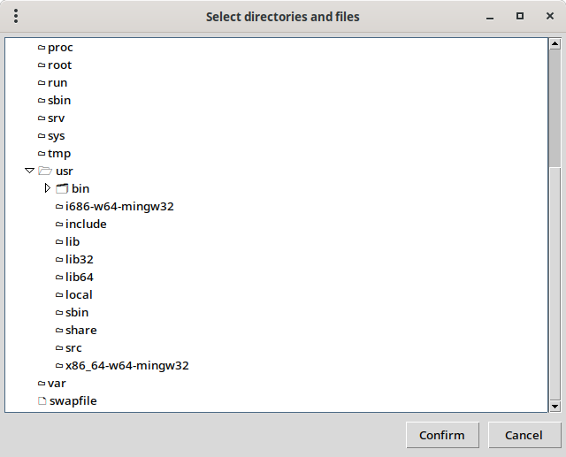
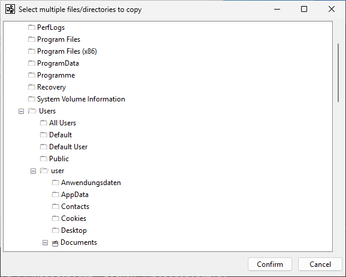

# tk_pathdialog
Dialog window for Tk to select directories and files that are returned as pathlib.Path

Linux:



Windows:



The tool is untested on Mac or other operating systems.

## Examples

### Simple way
```
import tk_pathdialog

paths = tk_pathdialog.askpaths(
			title = 'Select file path(s)',
			confirm = 'OK',
			cancel = 'Cancel',
			restriction = 'dir',
			multiple = False,
			initialdir = 'C:\\Users\\user\\Documents'
		)
```

### Object
```
child_window = AskPathsWindow(parent=tk_main_window)
paths = child_window.get()
```

### Parameters
- parent:	tkinter: parent Tk element / window
- confirm: str: text on button "Confirm" (None gives "Confirm")
- cancel:	str: text on button "Cancel" (None gives "Cancel")
- restriction:	str / None: "dir" if only directories to select, "file" if only files to select, something else or None if both are OK (default)
- multiple:		bool: True if more than one item to select (default is True)
- initialdir:		pathlib.Path/None: directory to focus on open (default is home directory)

### Result
List of pathlib.Path objects

## Dependencies

The standard libraries (tkinter and pathlib) are used. On windows you should have WMI for detecting drives, though a workaround is also implemented. You might install WMI using pip:
```
pip install wmi
```

## Legal Notice

### License
Respect GPL-3: https://www.gnu.org/licenses/gpl-3.0.en.html

### Disclaimer
Use the software at your own risk.

This is not a commercial product with an army of developers and a department for quality control behind it.
  
